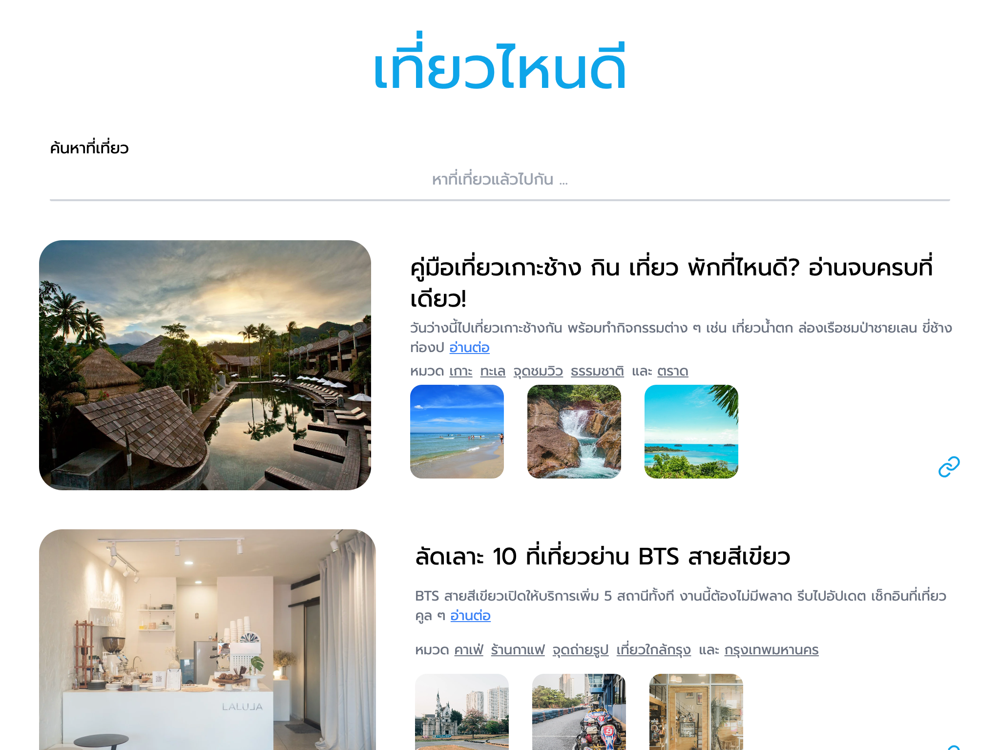

# Tourist Attraction Mini Project



Trip Finder is a React-based application designed to help users explore exciting travel destinations with ease. Simply enter a search keyword, and the app will instantly display a curated list of trips that match your interests. Each trip includes detailed descriptions, stunning images, and a shareable link for effortless trip planning.

## ✨Features

- **🔍 Search Trips**: Find travel destinations in real-time by entering keywords.
- **🏷️ Tag-Based Filtering**: Click on tags to refine your search and explore specific categories.
- **📖 Detailed Trip View**: Access in-depth information about each trip, including descriptions and multiple photos.
- **📎 Copy Trip URL**: Easily share your favorite trips by copying the URL to your clipboard.
- **📱 Responsive Design**: Optimized for seamless use across all devices, from mobile to desktop.

🌟 Start planning your next adventure with Trip Finder today! 🚀

<p align="center" >

</p>


## Installation

1. Clone the repository:

   ```sh
   git clone git@github.com:PotterWinter/react-tourist-attraction-mini-project.git

   ```

2. Navigate to the project directory & Install dependencies at server:
   ```sh
   cd server
   npm install
   npm run start

   ```
3. Navigate to the project directory & Install dependencies at client:

   ```sh
   cd client
   npm install
   npm run dev

   ```

4. Open your browser and go to http://localhost:5173 to see the application in action.

## 📌 Main Files & Components

### src/App.js
- **The root component that initializes the application.**

## 🎯 How It Works

### The Homepage component plays a crucial role in:
- **Fetching trip data based on user-input keywords.**
- **Displaying travel information and adding filtering capabilities based on user selection.**

## ⚡ Key Functionalities
- **getTitles() – Retrieves trip details from the server.**
- **handleTagClick(tag) – Filters trips based on selected tags.**
- **handleCopyLink(url) – Copies trip URLs for seamless sharing.**

## 📦 Tech Stack & Dependencies
- **React – A JavaScript library for building user interfaces.**
- **Axios – HTTP Requests are fetched or supported through an API and are Promise-based.**
## 🤝 How to Contribute
### We welcome contributions! If you’d like to improve the project, feel free to
- **Submit an issue for bug reports or feature suggestions.**
Open a pull request with your enhancements.
## 📜 License
- **This mini project is a skill assessment for the Tech Up Full Stack Bootcamp.**
